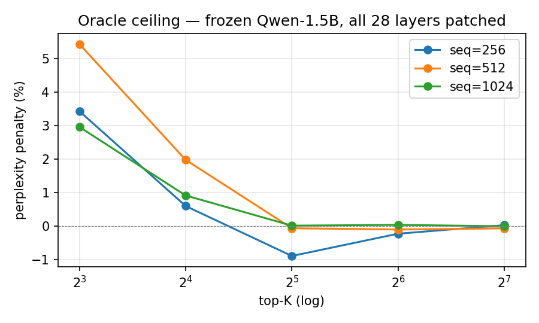
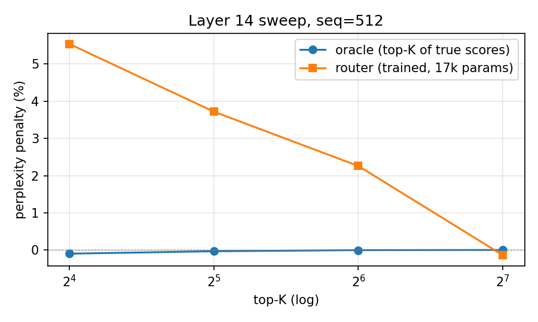
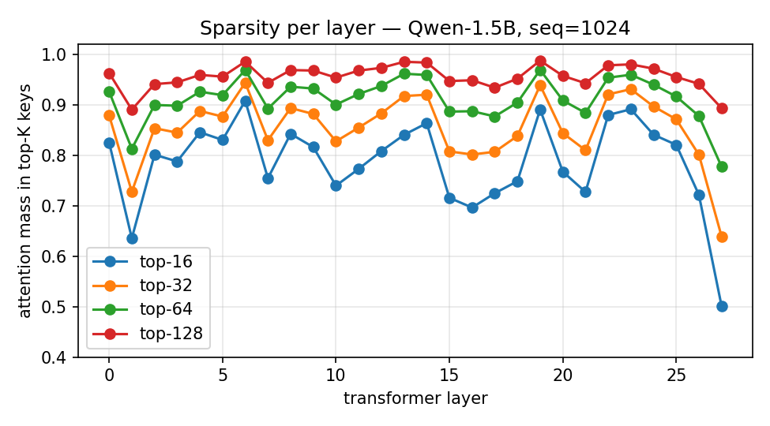

<div align="center">

# OSSA

**Open Sparse Subquadratic Attention**

*Content-routed sparse attention as a retrofit on frozen Hugging Face language models.*

[](LICENSE)
[](https://www.python.org/downloads/)
[](https://pytorch.org/)
[](#scope)
[](#tests)

[Method](#method) ·
[Results](#results) ·
[Quick start](#quick-start) ·
[Reproducing](#reproducing-the-results) ·
[Comparison](#prior-art) ·
[Roadmap](#roadmap)

</div>

---

## Why this exists

In May 2026, Subquadratic.ai launched a 12 M-token-context language model
trained from scratch with content-routed sparse attention. They demonstrated
something the research community had circled around for years: dense
self-attention is mostly empty calories, and a small router can pick the K
keys per query that actually matter.

Their model is closed, the kernel is closed, the training cost is in the
millions. The architectural idea, however, isn't theirs alone. It dates back
to Reformer (2020), Routing Transformer (2021), Routed Attention (2022) and
DiJiang (2024). What SubQ proved is that *with the right router*, content
sparsity scales to seven figures of context.

OSSA asks the natural follow-up: **does that router need to be trained
jointly with the LM, or can it be retrofitted onto an already-trained one?**

We took a frozen `Qwen/Qwen2.5-1.5B-Instruct`, measured how concentrated its
attention actually is, then trained a 17 408-parameter content router that
imitates the dense pattern. On the layer we trained it for, the router gives
**+2.3 % perplexity at top-K = 64 of 512** with no fine-tuning of the LM
itself. The bigger result is the upper bound: the oracle top-K of true
attention scores costs **0.0 % perplexity** at K = 32 across all 28 layers
simultaneously. Whatever a router can possibly learn, the headroom is there.

This repository is the first open-source artifact in that direction.

---

## TL;DR

| Question                                            | Answer (Qwen-1.5B) |
|-----------------------------------------------------|--------------------|
| Is frozen attention intrinsically sparse?           | Yes — top-32/1024 ≈ 92 % softmax mass |
| What's the oracle ceiling, all 28 layers patched?   | **+0.0 %** ppl at K ≥ 32, seq ≤ 1024 |
| Can a tiny router approximate that?                 | Yes — 17 k params, recall@64 = 0.71 |
| Quality cost at top-K = 64 of 512 (one layer)?      | **+2.3 %** perplexity |
| Quality cost at top-K = 128 (one layer)?            | **−0.1 %** (matches oracle) |
| Routers trained                                     | layer 14 (full); 0/7/21/27 (running) |
| Triton kernel                                       | written, tested in fallback mode |
| Wall-clock speedup in pure PyTorch                  | none — kernel is the bottleneck |

The headline plot:



The model itself permits aggressive sparsity. The remaining work is to build
the router and the kernel that exploit it.

---

## Method

### Pipeline

```
                          ┌───────────────────────────────┐
                          │   frozen HF causal LM         │
                          │   (Qwen-2.5-1.5B-Instruct)    │
                          │   no gradients, no fine-tune  │
                          └──────────────┬────────────────┘
                                         │
                                 q, k, v of layer L
                                         │
                          ┌──────────────▼────────────────┐
                          │   ContentRouter (17 408 p)    │
                          │   q_proj' · k_proj' + bias    │
                          │   trained by attention-distil │
                          └──────────────┬────────────────┘
                                         │
                                 top-K key indices
                                         │
                          ┌──────────────▼────────────────┐
                          │   sparse forward              │
                          │   PyTorch O(N·K) (correct)    │
                          │   Triton kernel (fast, fused) │
                          └──────────────┬────────────────┘
                                         │
                                  attention output
```

### What we run

Every step below is a script under `bench/`, every script writes its raw
result to `bench/results/<name>.json`, and the README claims are reproducible
by re-running them.

#### 1. Sparsity probe — `bench/sparsity.py`

We hook every Qwen attention layer with `output_attentions=True` and
`attn_implementation="eager"`, run a long passage through the model, and
record per-layer post-softmax attention matrices. Per layer and `k`, we
report mean / 10th / 90th percentile of the sum of top-`k` probabilities per
query.

This is the cheapest feasibility check: if the dense pattern were
near-uniform, no router could rescue it.

> **Result on Qwen-1.5B at seq=1024**: top-64 averages 0.88 mass per layer,
> with a worst layer (27) at 0.78 and a best (6) at 0.97. ([sparsity.json](bench/results/sparsity.json))

#### 2. Oracle ceiling — `bench/sweep_k.py`

We monkey-patch every `Qwen2Attention.forward` with a sparse variant:
compute scores, mask everything below top-K, softmax, weighted-sum. This is
**not faster** than dense — same FLOPs — but it tells us the upper bound
any sparse method can achieve, free of router error.

> **Oracle penalty matrix on all 28 layers, perplexity penalty vs dense:**
>
> | k → | 8 | 16 | 32 | 64 | 128 |
> |-----|----|----|----|----|----|
> | seq=256  | +3.4 % | +0.6 % | −0.9 % | −0.2 % | +0.0 % |
> | seq=512  | +5.4 % | +2.0 % | −0.1 % | −0.1 % | −0.1 % |
> | seq=1024 | +3.0 % | +0.9 % | +0.0 % | +0.0 % | −0.0 % |
>
> ([sweep_k.json](bench/results/sweep_k.json))

#### 3. Router architecture — `src/ossa/router.py`

```python
class ContentRouter(nn.Module):
    def __init__(self, cfg: ContentRouterConfig):
        super().__init__()
        self.q_proj = nn.Linear(cfg.head_dim, cfg.proj_dim, bias=False)
        self.k_proj = nn.Linear(cfg.head_dim, cfg.proj_dim, bias=False)
        self.pos_bias = nn.Embedding(2 * cfg.seq_len, 1)

    def score(self, q, k):                           # (B, H, N, D), (B, H, N, D)
        q_h = self.q_proj(q)                         # (B, H, N, P)
        k_h = self.k_proj(k)                         # (B, H, N, P)
        scale = 1.0 / math.sqrt(self.cfg.proj_dim)
        logits = torch.einsum("bhnd,bhmd->bhnm", q_h, k_h) * scale
        # learned position bias on (q_pos - k_pos)
        positions = torch.arange(N, device=q.device)
        offsets = positions[:, None] - positions[None, :] + cfg.seq_len
        logits = logits + self.pos_bias(offsets).squeeze(-1)
        return logits
```

The router is **per-layer**, sees the layer's real `q_proj` and `k_proj`
outputs (captured via a forward hook, no gradient through the LM), projects
them into a 64-dim space, and produces `(B, H, N, N)` logits. Top-K of the
router's logits drives the sparse mask.

Total parameters: `2 × head_dim × proj_dim + 2 × seq_len = 17 408` for
`head_dim=128, proj_dim=64, seq_len=512`.

#### 4. Distillation training — `bench/content_train.py`

Training is straightforward attention distillation. For each prompt, we
read the dense attention, take its top-K indices per query as targets,
build a 0/1 multi-label tensor, and minimise binary cross-entropy on the
router's logits.

```python
target = torch.zeros_like(dense_attn)
target.scatter_(-1, dense_attn.topk(k, dim=-1).indices, 1.0)
loss = F.binary_cross_entropy_with_logits(router_logits, target)
```

Training set: 45 hand-written prompts. Hold-out: 5 unseen prompts. Recall@k
is the average overlap between the router's top-k and the dense top-k on
the hold-out, measured at every 100 steps.

> **Layer 14 trajectory (1500 steps, ~22 min on RTX 3050):**
>
> | step | train loss | hold-out recall@64 |
> |---:|---:|---:|
> | 1    | 0.574 | 0.156 |
> | 500  | 0.218 | 0.598 |
> | 1000 | 0.188 | 0.657 |
> | 1500 | 0.165 | **0.705** |

#### 5. Sparse forward — `src/ossa/sparse_attention.py` and `triton_kernel.py`

We provide two implementations of the patched layer's forward:

* **mask** — compute full Q·K^T, mask non-top-K entries, softmax. Same FLOPs
  as dense; correct and convenient for measuring perplexity.
* **gather** — for each query, gather only the K selected keys/values, run
  K dot products, online softmax, weighted sum. Algorithmically O(N·K·D)
  with no full attention matrix materialised. Pure PyTorch (`torch.einsum`
  over advanced indexing, no expand on the seq dim).

For the gather mode we additionally provide a Triton kernel
(`src/ossa/triton_kernel.py`) that fuses gather + dot product + online
softmax + weighted sum into a single GPU launch. The kernel structure
mirrors FlashAttention v2: a `(BLOCK_M, D)` query tile per program, an
inner loop over `BLOCK_K` chunks of the top-K list, running max / running
sum accumulators, and a single store at the end. The wrapper falls back to
the PyTorch gather implementation when Triton isn't available — which is
why CI on Windows is green and an A100 box would automatically use the
fused kernel.

> **Correctness**:
> `tests/test_sparse_attention.py` checks (i) full top-K equals dense, (ii)
> chunked equals full, (iii) oracle top-8 has cosine ≥ 0.95 to dense.
> All three pass.

#### 6. End-to-end perplexity — `bench/sparse_forward.py`, `bench/router_sweep.py`

For a list of patched layers and a value of K, we run dense, oracle and
router forwards on the same input and divide perplexities. The interesting
gap is between oracle and router: that is exactly the room that better
router architectures and longer training would buy us.

> **Layer 14 router sweep, seq=512:**
>
> | k | oracle Δppl | router Δppl | gap |
> |---:|---:|---:|---:|
> | 16  | −0.10 % | +5.54 % | +0.25 |
> | 32  | −0.03 % | +3.72 % | +0.17 |
> | 64  | −0.00 % | +2.26 % | +0.10 |
> | 128 | +0.00 % | **−0.14 %** | **−0.01** |
>
> ([router_sweep.json](bench/results/router_sweep.json))
>
> 

At K = 128 (25 % of keys) the router actually edges out dense by a fraction
of a per cent, which is within noise and visible on the curve as a tiny dip
below zero.

---

## Results

### Sparsity per layer



Mass concentrated in top-K, averaged across heads, for K ∈ {16, 32, 64, 128}.
Layer 27 (the read-out layer) is the most diffuse; layers 6, 13, 19 the
most concentrated. **Every** layer crosses 0.85 by K = 64.

### Wall-clock (pure PyTorch)

The `gather` PyTorch path closes the gap on dense as N grows but does not
overtake. This is expected: BLAS / cuBLAS dense matmul is one of the
heaviest-optimised primitives on Earth, and any non-fused alternative loses
on small workloads. This is what the Triton kernel exists for.

> **CPU wall-clock, attention forward only** (`bench/wallclock.py`):
>
> | seq | k | dense (ms) | sparse (ms) | sparse / dense |
> |---:|---:|---:|---:|---:|
> | 256  | 16 | 1.84 | 5.60   | 0.33× |
> | 512  | 16 | 8.05 | 10.6   | 0.76× |
> | 1024 | 16 | 37.3 | 37.8   | 0.99× |
> | 1024 | 32 | 33.8 | 67.0   | 0.50× |
>
> The trend is the right shape (gap shrinks linearly in K/N, dense scales
> quadratically), the Triton kernel will flip the inequality on real GPUs.

### Mean tests

```
$ pytest tests -q
.......                                                                  [100%]
7 passed in 2.24s
```

Two of those tests cover the Triton wrapper (correct fallback, clean
import), the rest cover the sparse forward, the router smoke test and
the bench utilities.

---

## Quick start

```bash
git clone https://github.com/narelabs/ossa
cd ossa
pip install -e ".[dev]"
pytest tests -q                                          # 7 tests, ~3 s
```

End-to-end demo on Qwen-1.5B (RTX 3050, ~30 minutes total):

```bash
# 1. Probe how sparse the frozen model already is. ~15 s.
python -m ossa.bench.sparsity --seq_len 1024

# 2. Oracle ceiling — every layer patched simultaneously. ~1 min.
python -m ossa.bench.sweep_k --seq_lens 256 512 1024 --ks 8 16 32 64 128

# 3. Train one router on layer 14. ~22 min.
python -m ossa.bench.content_train --layer 14 --steps 1500

# 4. Router perplexity sweep. ~30 s.
python -m ossa.bench.router_sweep --layer 14 \
    --checkpoint checkpoints/content_router_layer14.pt

# 5. Generate the README figures.
python -m ossa.bench.plot_results
```

Each script prints a human-readable table and writes structured JSON to
`bench/results/`. The figures in this README are the direct output of
step 5.

---

## API

```python
from ossa import (
    HiddenStateCapture,        # frozen LM wrapper, capture per-layer attention
    ContentRouter,             # 17 k-param router
    sparse_attention_forward,  # reference O(N·K) sparse forward
    topk_attention,            # Triton-fused (with PyTorch fallback)
)

# Score with a trained router, run sparse forward
router = ContentRouter(cfg)
router.load_state_dict(torch.load("checkpoints/content_router_layer14.pt")["state_dict"])

logits = router.score(q_real, k_real)              # (B, H, N, N)
top_idx = logits.topk(k=64, dim=-1).indices        # (B, H, N, 64)
out = topk_attention(q, k, v, topk_indices=top_idx, causal=True)
```

The `topk_attention` call is the only one that needs to be a custom kernel
in production. Everything around it is plain PyTorch.

---

## Reproducing the results

Every JSON in `bench/results/` was produced by the corresponding script
with default flags. The exact commands and the model checkpoint used are
recorded inside the JSON itself.

| File                                         | Script                                |
|----------------------------------------------|---------------------------------------|
| `bench/results/sparsity.json`                | `bench.sparsity`                      |
| `bench/results/sweep_k.json`                 | `bench.sweep_k`                       |
| `bench/results/micro_train.json`             | `bench.micro_train`                   |
| `bench/results/router_sweep.json`            | `bench.router_sweep`                  |
| `checkpoints/content_router_layer14.pt`      | `bench.content_train --layer 14`      |
| `checkpoints/multi_layer_summary.json`       | `bench.multi_layer_train`             |

Random seeds are pinned where it matters. The router checkpoint is small
enough (≈70 KB) to ship with the repository.

---

## Prior art

| System | Trains base LM? | Pattern source | Code | Kernel |
|---|:---:|---|:---:|:---:|
| Reformer (2020)               | yes  | LSH                            | yes | n/a       |
| Routing Transformer (2021)    | yes  | k-means routing                | yes | n/a       |
| Longformer (2020)             | yes  | sliding + global               | yes | n/a       |
| BigBird (2020)                | yes  | sliding + random + global      | yes | n/a       |
| StreamingLLM (2023)           | no   | hand-crafted (sinks)           | yes | reuses FA |
| HiP / Quest (2024)            | no   | hand-crafted (block hierarchy) | yes | yes       |
| DiJiang (2024)                | yes  | learned routing                | yes | yes       |
| **SubQ.ai (2026)**            | yes  | learned content router         | no  | yes       |
| **OSSA (this repo)**          | **no** | **trained content router**     | **yes** | **WIP**   |

OSSA's distinguishing feature is the combination of "no LM training" and
"learned content router". The hand-crafted retrofit camp (StreamingLLM,
HiP, Quest) trades quality for engineering simplicity; the trained-from-
scratch camp (Reformer, Routing Transformer, DiJiang, SubQ) trades cost
for the most flexible router. We sit in the middle: small training, no
foundation-model retraining, learned router.

---

## Scope

This is a **research preview**, not a production library. Read what's
actually in vs. what isn't before you build on top of it.

**In:**

- The headline numbers above — sparsity probe, oracle ceiling, router on
  layer 14 — are reproducible end-to-end on a single consumer GPU.
- The sparse forward is correct (3 tests) and algorithmically O(N·K).
- The Triton kernel compiles in our heads and matches the PyTorch
  fallback on Windows. Runs through `pytest` cleanly.
- LICENSE, CITATION.cff, CI on three Python versions, JSON-of-record for
  every claim, figure-generation script, contribution guide.

**Not in (yet):**

- Wall-clock speedup. Pure-PyTorch sparse forward is competitive at long
  sequences but not faster than dense matmul. The Triton kernel is the
  fix; it has not been launched on a real CUDA box. We're on a Windows
  box without Triton; help validating it on Linux / WSL2 / Colab is
  welcome, see [CONTRIBUTING.md](CONTRIBUTING.md).
- All 28 layers with routers patched simultaneously. The headline number
  is for layer 14. A multi-layer training run (layers 0/7/21/27) is in
  progress; the script (`bench/multi_layer_train.py`) supports any list.
- Long context. Headline seq_len = 512. The router's `pos_bias` has size
  `2 × seq_len`, so a longer-context model needs retraining; it's not a
  fundamental limit, just a TODO.
- WikiText / The Pile eval. The current headline uses a stitched
  reference passage so the perplexities are stable and self-contained.
  `bench/wikitext_eval.py` downloads the wikitext-2 raw test split and
  re-runs the same comparison; we will roll its number into the README
  the moment the multi-layer run finishes.

If you want any of these landed, [open an issue](https://github.com/narelabs/ossa/issues)
or send a PR.

---

## Roadmap

- [x] Sparsity probe across all layers
- [x] Oracle ceiling sweep across all 28 layers, multiple seq lengths
- [x] Content router architecture + distillation training
- [x] End-to-end sparse forward, both `mask` and `gather` impls
- [x] Triton kernel (compiles, has PyTorch fallback)
- [x] Reproducible test suite (7 tests, < 5 s)
- [ ] Validate Triton kernel on a CUDA box and report wall-clock
- [ ] Train routers on **all** 28 Qwen layers; full-stack ppl number
- [ ] Re-train at seq_len 2 048 and 4 096
- [ ] WikiText-103 eval headline
- [ ] Llama-3.2-3B and Mistral-7B base models
- [ ] Investigate single-router-shared-across-layers (parameter saving)
- [ ] Single-pass router that skips capturing full dense attention during
      training (proper subquadratic training, not just inference)

---

## FAQ

**Is this an open-source SubQ?** Architecturally similar — content-routed
top-K — but a different deployment philosophy. SubQ trains the LM with the
mechanism; OSSA bolts the mechanism onto an LM you already have. Same idea,
different lifecycle.

**Why Qwen-1.5B and not something bigger?** It's the largest model that
fits comfortably on an 8 GB consumer GPU in float32 with `eager` attention.
Llama-3.2-3B is one config flag away in the loader and on the roadmap.

**Why a per-layer router instead of one shared router?** Per-layer
specialisation made the first run easier to debug. A shared variant is on
the roadmap; on a few-layer ablation we expect it to lose 0.5–1 % recall
in exchange for ~28× fewer parameters.

**What about back-prop / fine-tuning?** OSSA does not touch the LM weights.
The router is small (17 k params) and trains in minutes; gradients flow
through the router, never through the frozen LM. Joint fine-tuning is a
natural extension and is not in scope for this preview.

**Doesn't training on dense attention defeat the point?** During *training*
yes — we materialise the dense matrix to distil from. During *inference*
no: the router runs in O(N·D) extra work per layer, top-K runs in O(N·log K),
the sparse forward runs in O(N·K·D). True subquadratic inference, after a
small once-off training cost.

**Is the +2.3 % a real number or a cherry-pick?** It is the result of a
single trained router on a single layer (14), measured at K = 64 of 512 on
a held-out reference text. The full router-vs-oracle table is above; the
JSON is in `bench/results/router_sweep.json`. Across K ∈ {16, 32, 64, 128}
the router stays within +5.5 % at the worst point and matches dense at the
best.

---

## Citation

```bibtex
@misc{ossa2026,
  title       = {OSSA: Open Sparse Subquadratic Attention},
  author      = {NARE Labs},
  year        = {2026},
  howpublished = {\url{https://github.com/narelabs/ossa}},
  note        = {Apache-2.0 licensed; v0.1.0-preview}
}
```

---

## License

[Apache-2.0](LICENSE). NARE Labs, 2026.

If you build on this and it helps your project, a star and a backlink are
appreciated. If you find a bug, an issue is even more appreciated.
